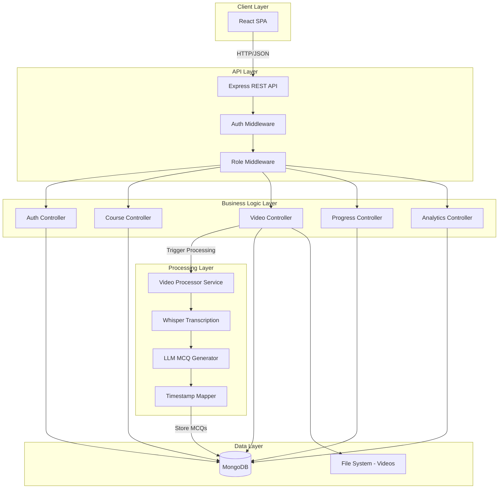
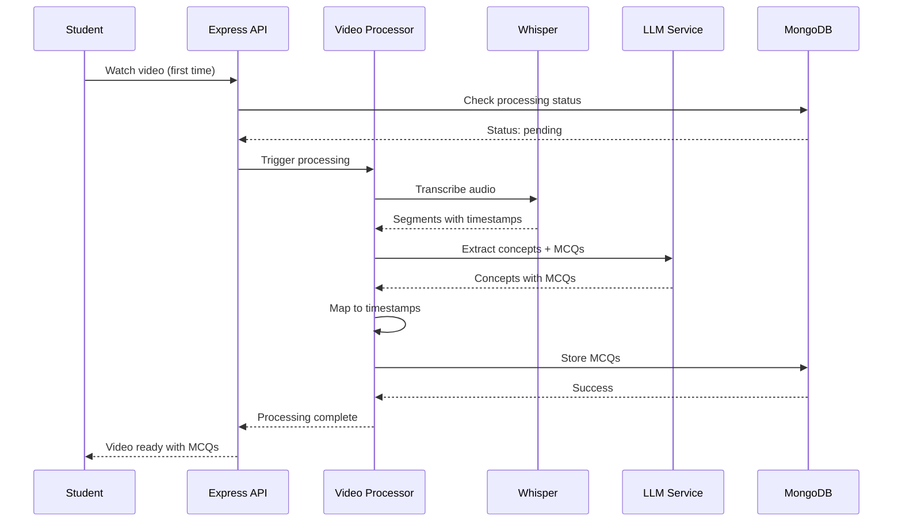
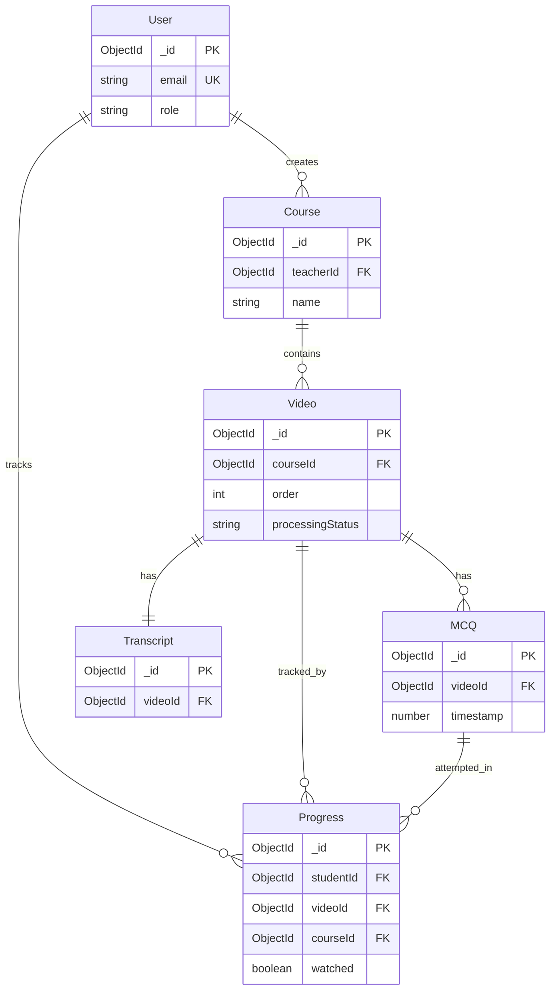
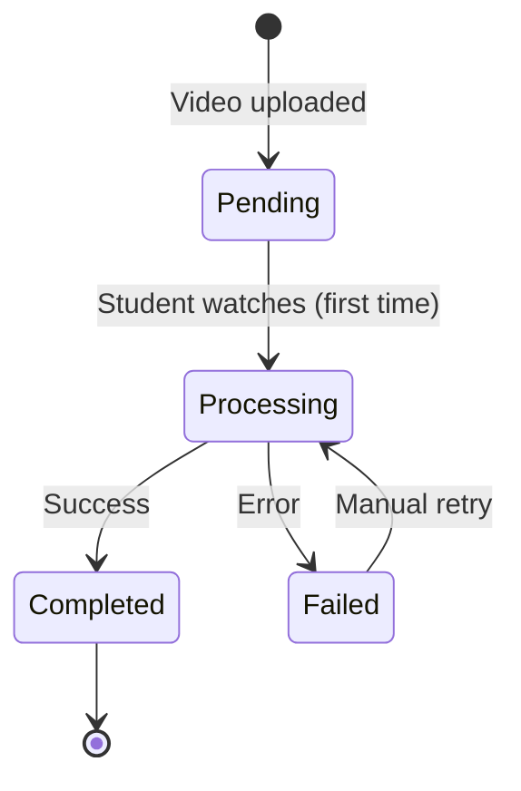

# Design Document: Interactive Video Learning Platform

## Overview

The Interactive Video Learning Platform is a MERN stack web application that creates an adaptive learning experience through AI-generated multiple-choice questions (MCQs) embedded in educational videos. The system uses OpenAI Whisper for audio transcription and Mistral-7B-Instruct LLM for concept extraction and MCQ generation. When students answer incorrectly, the video replays from the current concept's timestamp, enforcing mastery-based learning where students must answer each MCQ correctly before progressing.

### Key Features

- JWT-based authentication with email/password and Google OAuth support
- Role-based access control (teacher/student)
- Course and video management for teachers
- On-demand video processing (Whisper transcription + LLM MCQ generation)
- Sequential video unlocking based on MCQ completion
- Concept-level replay on incorrect answers (not full video restart)
- Real-time progress tracking and teacher analytics
- Adaptive learning with concept replay mechanism

### Technology Stack

- **Frontend**: React SPA with React Router
- **Backend**: Node.js + Express REST API
- **Database**: MongoDB with Mongoose ODM
- **Video Storage**: Server filesystem
- **Video Processing**: Whisper (audio transcription) + Mistral-7B-Instruct (MCQ generation)
- **Authentication**: JWT with bcrypt password hashing + Google OAuth 2.0

## Architecture

### System Architecture Diagram



### Architecture Layers

#### 1. Client Layer
- React SPA with component-based architecture
- React Router for navigation
- Axios for API communication
- Video player with custom MCQ overlay

#### 2. API Layer
- Express REST API with JSON responses
- JWT authentication middleware
- Role-based authorization middleware
- Request validation and error handling

#### 3. Business Logic Layer
- Controllers handle HTTP requests/responses
- Service layer for complex business logic
- Separation of concerns between controllers and services

#### 4. Processing Layer
- Asynchronous video processing pipeline
- Whisper integration for transcription
- LLM integration for MCQ generation
- Timestamp mapping algorithm

#### 5. Data Layer
- MongoDB for structured data
- Filesystem for video storage
- Mongoose ODM for data modeling

### Processing Pipeline



## Components and Interfaces

### Frontend Components

#### Authentication Components
- **LoginPage**: Email/password login form
- **RegisterPage**: Registration form with role selection
- **ProtectedRoute**: HOC for route protection

#### Teacher Components
- **TeacherDashboard**: Course management interface
- **CourseCreator**: Form for creating new courses
- **VideoUploader**: Multi-video upload interface
- **AnalyticsDashboard**: Student performance metrics

#### Student Components
- **StudentDashboard**: Course search and enrollment
- **CourseViewer**: Video list with lock/unlock status
- **VideoPlayer**: Custom player with MCQ overlay
- **ProgressTracker**: Personal progress visualization

#### Shared Components
- **Navbar**: Navigation with role-based menu
- **CourseCard**: Course display component
- **VideoCard**: Video thumbnail and metadata
- **MCQOverlay**: Black overlay with MCQ display

### Backend API Endpoints

#### Authentication Endpoints
```
POST /api/auth/register
  Body: { name, email, password, role }
  Response: { token, user }

POST /api/auth/login
  Body: { email, password }
  Response: { token, user }

GET /api/auth/profile
  Headers: Authorization: Bearer <token>
  Response: { user }
```

#### Course Endpoints
```
POST /api/courses
  Headers: Authorization: Bearer <token>
  Body: { name, description, category, difficulty }
  Response: { course }
  Auth: Teacher only

GET /api/courses
  Query: ?search=<term>
  Response: { courses[] }

GET /api/courses/:courseId
  Response: { course, videos[] }

DELETE /api/courses/:courseId
  Headers: Authorization: Bearer <token>
  Auth: Teacher (owner) only
```

#### Video Endpoints
```
POST /api/courses/:courseId/videos
  Headers: Authorization: Bearer <token>
  Body: FormData with video file + metadata
  Response: { video }
  Auth: Teacher (course owner) only

GET /api/videos/:videoId
  Response: { video, mcqs[], processingStatus }

GET /api/videos/:videoId/stream
  Response: Video file stream

POST /api/videos/:videoId/process
  Headers: Authorization: Bearer <token>
  Triggers: Whisper + LLM processing
  Response: { status: "processing" }
  Auth: Student only (on first watch)
```

#### Progress Endpoints
```
POST /api/progress/mcq-answer
  Headers: Authorization: Bearer <token>
  Body: { videoId, mcqId, answer }
  Response: { correct: boolean, correctAnswer: string, shouldReplayFromTimestamp: number | null, attempts: number }

GET /api/progress/course/:courseId
  Headers: Authorization: Bearer <token>
  Response: { completionPercentage, videoProgress[] }

POST /api/progress/mark-watched
  Headers: Authorization: Bearer <token>
  Body: { videoId }
  Response: { success: boolean, nextVideoUnlocked: boolean }
```

#### Analytics Endpoints
```
GET /api/analytics/course/:courseId
  Headers: Authorization: Bearer <token>
  Response: { 
    enrollmentCount,
    avgMcqScore,
    questionAccuracy[],
    studentScores[]
  }
  Auth: Teacher (course owner) only
```

### Service Interfaces

#### VideoProcessorService
```typescript
interface VideoProcessorService {
  processVideo(videoId: string): Promise<ProcessingResult>;
  extractAudio(videoPath: string): Promise<string>;
  transcribeAudio(audioPath: string): Promise<TranscriptSegment[]>;
  generateMCQs(transcript: string): Promise<Concept[]>;
  mapTimestamps(concepts: Concept[], segments: TranscriptSegment[]): Promise<MCQ[]>;
}

interface TranscriptSegment {
  start: number;
  end: number;
  text: string;
}

interface Concept {
  title: string;
  question: string;
  options: string[]; // ["A. option1", "B. option2", "C. option3", "D. option4"]
  answer: string; // "A", "B", "C", or "D"
}

interface MCQ extends Concept {
  timestamp: number;
  videoId: string;
}

interface ProcessingResult {
  success: boolean;
  mcqCount: number;
  error?: string;
}
```

## Data Models

### User Model
```typescript
interface User {
  _id: ObjectId;
  name: string;
  email: string; // unique, indexed
  password: string; // bcrypt hashed
  role: "teacher" | "student";
  profilePicture?: string;
  bio?: string;
  createdAt: Date;
  updatedAt: Date;
}

// Indexes
// - email: unique
// - role: non-unique (for filtering)
```

### Course Model
```typescript
interface Course {
  _id: ObjectId;
  name: string; // 3-100 characters
  description: string; // 10-1000 characters
  category: string;
  difficulty: "beginner" | "intermediate" | "advanced";
  teacherId: ObjectId; // ref: User
  thumbnail?: string;
  createdAt: Date;
  updatedAt: Date;
}

// Indexes
// - teacherId: non-unique
// - name: text index (for search)
```

### Video Model
```typescript
interface Video {
  _id: ObjectId;
  courseId: ObjectId; // ref: Course
  filename: string;
  filepath: string; // server filesystem path
  duration: number; // seconds
  thumbnail: string;
  order: number; // sequence in course
  processingStatus: "pending" | "processing" | "completed" | "failed";
  processingError?: string;
  uploadedAt: Date;
  processedAt?: Date;
}

// Indexes
// - courseId: non-unique
// - courseId + order: compound unique
```

### MCQ Model
```typescript
interface MCQ {
  _id: ObjectId;
  videoId: ObjectId; // ref: Video
  conceptTitle: string;
  question: string;
  options: string[]; // length: 4, format: ["A. text", "B. text", "C. text", "D. text"]
  correctAnswer: string; // "A", "B", "C", or "D"
  timestamp: number; // seconds into video
  createdAt: Date;
}

// Indexes
// - videoId: non-unique
// - videoId + timestamp: compound (for sorting)
```

### Progress Model
```typescript
interface Progress {
  _id: ObjectId;
  studentId: ObjectId; // ref: User
  videoId: ObjectId; // ref: Video
  courseId: ObjectId; // ref: Course
  watched: boolean; // true when all MCQs answered correctly
  mcqAttempts: {
    mcqId: ObjectId;
    attempts: number;
    lastAnswer?: string;
    correct: boolean;
  }[];
  timeSpent: number; // seconds
  lastWatchedAt: Date;
  completedAt?: Date;
}

// Indexes
// - studentId + videoId: compound unique
// - studentId + courseId: compound (for course progress queries)
// - courseId: non-unique (for analytics)
```

### Transcript Model
```typescript
interface Transcript {
  _id: ObjectId;
  videoId: ObjectId; // ref: Video, unique
  segments: {
    start: number;
    end: number;
    text: string;
  }[];
  fullText: string;
  createdAt: Date;
}

// Indexes
// - videoId: unique
```

### Database Relationships



## Video Processing Implementation

### MCQ Generation Algorithm (from notebook)

The MCQ generation follows the logic from `notebook3bd41d8bfe (1).ipynb`:

#### Step 1: Audio Extraction
```typescript
async extractAudio(videoPath: string): Promise<string> {
  // Use ffmpeg to extract audio to WAV format
  // Command: ffmpeg -i video.mp4 -ar 16000 -ac 1 -c:a pcm_s16le audio.wav
  const audioPath = `${videoPath}.wav`;
  await execFFmpeg([
    '-i', videoPath,
    '-ar', '16000',
    '-ac', '1',
    '-c:a', 'pcm_s16le',
    audioPath
  ]);
  return audioPath;
}
```

#### Step 2: Whisper Transcription
```typescript
async transcribeAudio(audioPath: string): Promise<TranscriptSegment[]> {
  // Use Whisper model for transcription
  // Returns segments with start/end timestamps and text
  const model = await loadWhisperModel('base'); // or 'small', 'medium'
  const result = await model.transcribe(audioPath, {
    language: 'en',
    task: 'transcribe'
  });
  
  return result.segments.map(seg => ({
    start: seg.start,
    end: seg.end,
    text: seg.text.trim()
  }));
}
```

#### Step 3: LLM Concept Extraction and MCQ Generation
```typescript
async generateMCQs(transcript: string): Promise<Concept[]> {
  // Truncate to avoid token overflow
  const maxChars = 3000;
  const truncated = transcript.substring(0, maxChars);
  
  const prompt = `You are an AI tutor. From the transcript below, do TWO things:
1. Identify 3 to 5 key learning concepts
2. For EACH concept, write ONE multiple choice question with 4 options

IMPORTANT: Return ONLY a valid JSON array. No explanation. No markdown. Example format:
[
  {
    "title": "Concept Name",
    "question": "What is...?",
    "options": ["A. option1", "B. option2", "C. option3", "D. option4"],
    "answer": "A"
  }
]

Transcript:
${truncated}`;

  const response = await callLLM(prompt);
  
  // Extract JSON from response
  const jsonMatch = response.match(/\[.*\]/s);
  if (!jsonMatch) {
    throw new Error('No JSON array found in LLM response');
  }
  
  const concepts = JSON.parse(jsonMatch[0]);
  
  // Validate structure
  return concepts.filter(c => 
    c.title && c.question && 
    Array.isArray(c.options) && c.options.length === 4 &&
    c.answer && ['A', 'B', 'C', 'D'].includes(c.answer)
  );
}
```

#### Step 4: Timestamp Mapping
```typescript
async mapTimestamps(
  concepts: Concept[], 
  segments: TranscriptSegment[]
): Promise<MCQ[]> {
  const totalDuration = segments[segments.length - 1]?.end || 60;
  const mapped: MCQ[] = [];
  
  for (let i = 0; i < concepts.length; i++) {
    const concept = concepts[i];
    
    // Try keyword matching
    const titleWords = new Set(
      concept.title.toLowerCase().split(' ').filter(w => w.length > 3)
    );
    
    let bestSegment: TranscriptSegment | null = null;
    
    for (const seg of segments) {
      const segWords = new Set(seg.text.toLowerCase().split(' '));
      const overlap = Array.from(titleWords).filter(w => segWords.has(w));
      
      if (overlap.length > 0) {
        bestSegment = seg;
        break;
      }
    }
    
    let timestamp: number;
    
    if (bestSegment) {
      // Use matched segment timestamp
      timestamp = bestSegment.start;
    } else {
      // Fallback: evenly distribute across video
      timestamp = (i / concepts.length) * totalDuration;
    }
    
    mapped.push({
      ...concept,
      timestamp,
      videoId: '' // Set by caller
    });
  }
  
  // Sort by timestamp
  return mapped.sort((a, b) => a.timestamp - b.timestamp);
}
```

### Processing Status Flow



### Error Handling Strategy

1. **Transcription Failures**
   - Log error with video ID and timestamp
   - Set status to "failed"
   - Allow manual retry via API endpoint

2. **MCQ Generation Failures**
   - Retry up to 2 times with exponential backoff
   - If all retries fail, log error and notify student
   - Store partial results if some concepts succeeded

3. **Timestamp Mapping Failures**
   - Always fallback to even distribution
   - Never fail the entire process due to mapping issues

## Testing Strategy

### Unit Testing

#### Backend Unit Tests
- **Auth Controller**: Registration validation, login logic, JWT generation
- **Course Controller**: CRUD operations, search functionality
- **Video Controller**: Upload validation, processing triggers
- **Progress Controller**: MCQ answer validation, restart logic
- **Video Processor Service**: Audio extraction, transcription parsing, MCQ validation
- **Timestamp Mapper**: Keyword matching, fallback distribution

#### Frontend Unit Tests
- **Auth Components**: Form validation, error handling
- **Video Player**: MCQ overlay display, answer submission
- **Progress Tracker**: Percentage calculation, status display

### Integration Testing

- **Auth Flow**: Register → Login → Protected route access
- **Course Creation Flow**: Create course → Upload video → Trigger processing
- **Video Watch Flow**: Watch video → Answer MCQ → Replay concept on wrong answer
- **Progress Tracking**: Complete video → Unlock next video
- **Analytics Flow**: Student completes videos → Teacher views analytics

### End-to-End Testing

- **Teacher Workflow**: Register → Create course → Upload videos → View analytics
- **Student Workflow**: Register → Search course → Watch videos → Answer MCQs → Track progress
- **Adaptive Learning**: Wrong answer → Video replays from concept timestamp → Correct answer → Video continues to next concept

### Testing Tools

- **Backend**: Jest + Supertest
- **Frontend**: Jest + React Testing Library
- **E2E**: Cypress or Playwright
- **API Testing**: Postman collections

## Error Handling

### API Error Responses

All API errors follow this format:
```json
{
  "success": false,
  "message": "Human-readable error message",
  "error": "Technical error details (dev mode only)"
}
```

### HTTP Status Codes

- **200**: Success
- **201**: Created
- **400**: Bad Request (validation errors)
- **401**: Unauthorized (missing/invalid token)
- **403**: Forbidden (insufficient permissions)
- **404**: Not Found
- **500**: Internal Server Error

### Frontend Error Handling

- Display user-friendly error messages
- Log technical errors to console (dev mode)
- Provide retry mechanisms for failed operations
- Show loading states during async operations

### Video Processing Errors

```typescript
enum ProcessingError {
  AUDIO_EXTRACTION_FAILED = "Failed to extract audio from video",
  TRANSCRIPTION_FAILED = "Failed to transcribe audio",
  MCQ_GENERATION_FAILED = "Failed to generate MCQs",
  TIMESTAMP_MAPPING_FAILED = "Failed to map MCQs to timestamps",
  STORAGE_FAILED = "Failed to store processing results"
}
```

## Security Considerations

### Authentication Security

- Passwords hashed with bcrypt (salt rounds: 10)
- JWT tokens expire after 7 days
- Tokens stored in localStorage (consider httpOnly cookies for production)
- Password strength validation (minimum 8 characters)

### Authorization Security

- Role-based middleware checks on all protected routes
- Teachers can only modify their own courses
- Students can only access enrolled courses
- Video files served through authenticated endpoints

### Input Validation

- Email format validation
- File type validation (videos: MP4, AVI, MOV)
- File size limits (videos: 500MB, images: 5MB)
- SQL injection prevention via Mongoose ODM
- XSS prevention via input sanitization

### Video Storage Security

- Videos stored outside public directory
- Access controlled via authenticated streaming endpoint
- Filename sanitization to prevent path traversal

## Performance Considerations

### Video Processing Optimization

- Process videos asynchronously (don't block API response)
- Use worker threads or separate service for processing
- Implement processing queue for multiple simultaneous uploads
- Cache transcriptions to avoid reprocessing

### Database Optimization

- Index frequently queried fields (email, courseId, videoId)
- Use compound indexes for common query patterns
- Implement pagination for large result sets
- Use MongoDB aggregation for analytics queries

### Frontend Optimization

- Lazy load video player component
- Implement virtual scrolling for long course lists
- Cache API responses with React Query or SWR
- Optimize video streaming with adaptive bitrate

### Scalability Considerations

- Separate video processing into microservice
- Use CDN for video delivery (future enhancement)
- Implement Redis caching for frequently accessed data
- Consider MongoDB sharding for large datasets

## Deployment Architecture

### Development Environment

```
Frontend: localhost:3000 (React dev server)
Backend: localhost:5000 (Node.js + Express)
Database: localhost:27017 (MongoDB)
Video Storage: ./uploads/videos/
```

### Production Environment (Recommended)

```
Frontend: Vercel or Netlify
Backend: Heroku, Railway, or AWS EC2
Database: MongoDB Atlas
Video Storage: AWS S3 or similar cloud storage
Video Processing: AWS Lambda or separate worker service
```

### Environment Variables

```env
# Backend .env
PORT=5000
MONGODB_URI=mongodb://localhost:27017/video-learning
JWT_SECRET=your-secret-key-here
JWT_EXPIRE=7d
VIDEO_UPLOAD_PATH=./uploads/videos
MAX_VIDEO_SIZE=524288000
WHISPER_MODEL=base
LLM_API_KEY=your-llm-api-key
LLM_API_URL=https://api.llm-provider.com/v1/chat

# Frontend .env
REACT_APP_API_URL=http://localhost:5000/api
```

## Future Enhancements

### Phase 2 Features

- Video resume functionality (save playback position)
- Multiple attempts with hints before restart
- Checkpoint system (restart from last checkpoint, not beginning)
- Video quality selection
- Subtitle support

### Phase 3 Features

- Course categories and filtering
- Course recommendations
- Student discussion forums
- Certificate generation on course completion
- Mobile app (React Native)

### Phase 4 Features

- Live streaming with real-time MCQs
- Collaborative learning (study groups)
- Gamification (badges, leaderboards)
- Advanced analytics (learning patterns, time-to-completion)
- Multi-language support

## Implementation Roadmap

### Sprint 1: Foundation (Week 1-2)
- Set up project structure (MERN boilerplate)
- Implement authentication (register, login, JWT)
- Create User and Course models
- Build basic frontend layout

### Sprint 2: Course Management (Week 3-4)
- Implement course CRUD operations
- Build video upload functionality
- Create teacher dashboard
- Implement course search

### Sprint 3: Video Processing (Week 5-6)
- Integrate Whisper for transcription
- Integrate LLM for MCQ generation
- Implement timestamp mapping algorithm
- Build processing status tracking

### Sprint 4: Student Experience (Week 7-8)
- Build video player with MCQ overlay
- Implement MCQ answer validation
- Create restart-on-failure logic
- Build progress tracking

### Sprint 5: Analytics & Polish (Week 9-10)
- Implement teacher analytics dashboard
- Add error handling and validation
- Perform testing and bug fixes
- Deploy to production

## Conclusion

This design provides a comprehensive blueprint for building the Interactive Video Learning Platform. The architecture is modular, scalable, and follows MERN stack best practices. The video processing pipeline leverages proven AI technologies (Whisper + LLM) with a robust fallback strategy for timestamp mapping. The adaptive learning mechanism (restart on failure) creates a unique educational experience that enforces mastery-based learning.

The design prioritizes:
- **Security**: JWT authentication, role-based access, input validation
- **Performance**: Async processing, database indexing, caching strategies
- **Maintainability**: Clear separation of concerns, modular architecture
- **Scalability**: Microservice-ready processing layer, cloud deployment options
- **User Experience**: Intuitive interfaces, real-time feedback, progress tracking

Implementation should follow the roadmap, with each sprint delivering working features that can be tested and refined before moving to the next phase.
